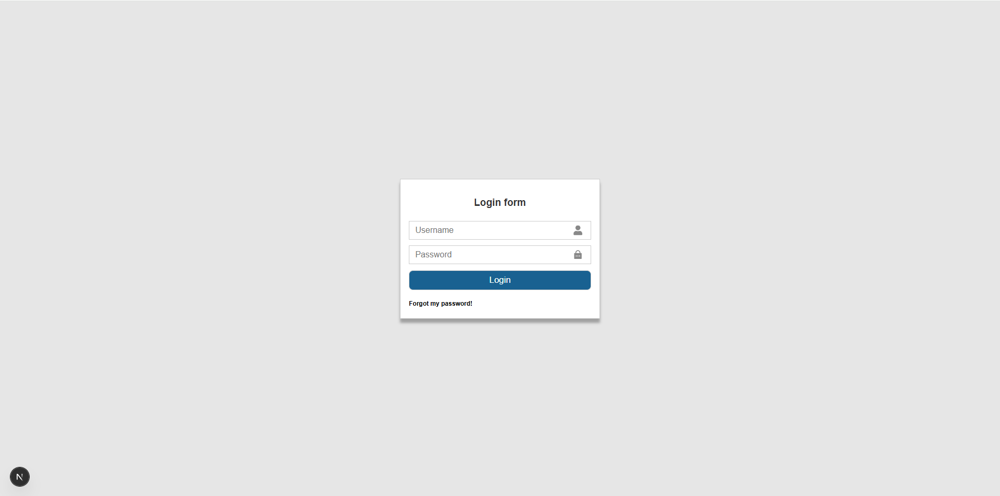

# WorkForce SYSTEM

The WorkForce SYSTEM is a system designed to solve real-life problems I personally encounter in my job as a Team Lead of a field service crew. Also, it was a great learning project that helped me gain a lot of experience.

WorkForce SYSTEM is a management platform for tracking employees, work hours, company vehicles (registration and technical condition). It also has the ability to be upgraded to any new request that occur as necessary.

## Features

- Authentication (JWT)
- Role based authorization
- Admin dashboard
- Employee dashboard
- Maps showing real-time employee (teams) locations
- Notifications for vehicle registration and maintenance deadlines
- Automatic account creation: when a new employee is added, a username is generated and emailed. Employee sets password via link
- Live updates on number of employees and deployed groups (green = field, red = home)

## Tech Stack

Frontend:

- Next.js
- React
- SCSS

Backend:

- Java Spring Boot
- Spring Security
- JWT
- MySQL
- Lombok
- Email notifications (Spring Boot Mail)

DevOps:

- Docker

## Project structure

- backend/
- frontend/

## Screenshots

### Login page

### Admin dashboard

### Groups section

## Author

Filip Buzuk - codename: GoldStar
